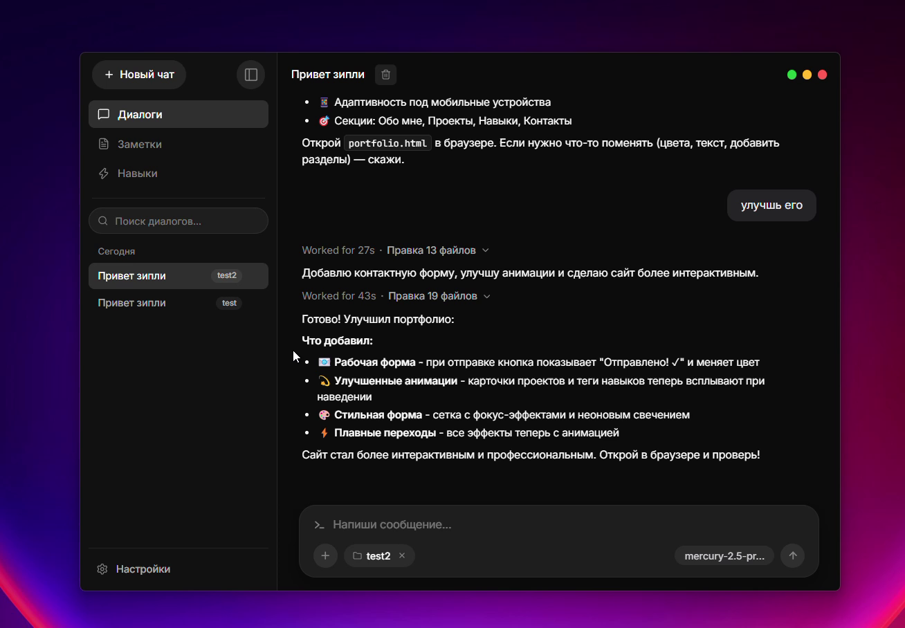

<div align="center">

  <p>
    <strong>English</strong> &nbsp;|&nbsp; <a href="README.ru.md">Русский</a>
  </p>

  

  # Zipply

  **Simple AI Agent**

  [](https://github.com/AmnesiaCode888/Zipply/releases)
  [](LICENSE)
  [](https://t.me/zipplyai)
  [](https://www.typescriptlang.org/)
  [](https://www.electronjs.org/)
  [](https://reactjs.org/)

  <p>
    Autonomous desktop AI coding partner & multi-agent workspace.<br/>
    Native Model Context Protocol (MCP) integration, dynamic skills, and long-term project memory.
  </p>

  <p>
    <a href="https://github.com/AmnesiaCode888/Zipply/releases/download/v0.4.0-beta/Zipply-0.4.0-win-x64.exe">
      
    </a>
    &nbsp;
    <a href="https://github.com/AmnesiaCode888/Zipply/releases/download/v0.4.0-beta/Zipply-0.4.0-linux-x86_64.AppImage">
      
    </a>
  </p>

</div>

---

##  Workspace Preview

<div align="center">
  
</div>

---

##   Multi-Agent Swarm

Zipply orchestrates specialized agents cooperating across a shared Blackboard architecture:

| Agent | Role | Scope & Capabilities |
| :--- | :--- | :--- |
| **ZipplyAgent** | Primary Engineer | Full filesystem read/write, CLI tool execution, multi-step self-correction |
| **ArchitectAgent** | System Architect | Read-only AST analysis, multi-file blueprints, dependency boundary mapping |
| **WorkerAgent** | Surgical Implementer | Fast localized diff edits, incremental builds, and test verification |
| **AskAgent** | Codebase Explorer | Semantic code navigation, codebase Q&A without modifying project state |
| **TerminalAgent** | Shell Specialist | Streaming command execution, smart log truncation, and error triage |
| **WebSearchAgent** | Online Researcher | Real-time web search and documentation retrieval |

---

##  Supported AI Providers

Direct connection to state-of-the-art model APIs without mandatory subscriptions or proxies:

<div align="center">

[](https://ai.google.dev/)
[](https://anthropic.com/)
[](https://openai.com/)
[](https://deepseek.com/)
[](https://ollama.ai/)
[](https://openrouter.ai/)

</div>

* **Google Gemini** — Gemini 3.8 Flash, Gemini 3.7 Flash, Gemini 3.1 Pro
* **Anthropic Claude** — Claude Fable 5.1, Claude Opus 5, Claude Sonnet 5
* **OpenAI** — GPT-6 Astra, GPT-5.6 Luna, GPT-5.6 Terra
* **DeepSeek** — DeepSeek-V4 Flash, DeepSeek-V4 Pro, DeepSeek-V3.2
* **Ollama** — Local self-hosted LLMs (DeepSeek-V4, Llama 4, Qwen 3)
* **OpenRouter** & OpenAI-compatible unified endpoints

---

##  Core Capabilities

### Model Context Protocol (MCP)
* Native stdio MCP client implementation.
* On-disk tool schema caching for minimal LLM context window overhead.
* 1-click import compatible with Cursor, Claude Desktop, and Antigravity configs.
* In-app server status management, environment variable controls, and tool authorization.

### Dynamic Skills Framework
* Markdown-based skills with frontmatter triggers and auto-enforcement directives.
* Semantic vector embeddings for automatic context-based skill retrieval.
* Integrated in-app Skill Editor with live preview and validation.

### Long-Term Memory & Blackboard
* Subject-based conflict invalidation: new architectural decisions automatically supersede outdated assumptions.
* Blackboard working memory tracking active hypotheses and execution context across subagent lifecycles.

### Reliability & Error Recovery
* 4-level fuzzy diff engine with Levenshtein fallback and indentation preservation.
* Fatal syntax error classification with automatic edit rollback.
* Smart head/tail log truncation preserving critical command outputs, exit codes, and stack traces.

---

##  Pre-built Downloads (v0.4.0-beta)

| Platform | Format | Architecture | Direct Download |
| :--- | :--- | :--- | :--- |
| **Windows** | NSIS Installer (`.exe`) | x64 | [`Zipply-0.4.0-win-x64.exe`](https://github.com/AmnesiaCode888/Zipply/releases/download/v0.4.0-beta/Zipply-0.4.0-win-x64.exe) |
| **Linux (Portable)** | AppImage | x86_64 | [`Zipply-0.4.0-linux-x86_64.AppImage`](https://github.com/AmnesiaCode888/Zipply/releases/download/v0.4.0-beta/Zipply-0.4.0-linux-x86_64.AppImage) |
| **Debian / Ubuntu** | Package (`.deb`) | amd64 | [`zipply-0.4.0-linux-amd64.deb`](https://github.com/AmnesiaCode888/Zipply/releases/download/v0.4.0-beta/zipply-0.4.0-linux-amd64.deb) |
| **Void Linux** | Package (`.xbps`) | x86_64 | [`zipply-0.4.0_1.x86_64.xbps`](https://github.com/AmnesiaCode888/Zipply/releases/download/v0.4.0-beta/zipply-0.4.0_1.x86_64.xbps) |

> [!TIP]
> All build artifacts, SHA256 checksums, and release notes are available on the [GitHub Releases](https://github.com/AmnesiaCode888/Zipply/releases) page.

---

##  Development & Build

### Prerequisites
* Node.js >= 18.0.0
* npm >= 9.0.0
* Git

### Quickstart
```bash
# Clone the repository
git clone https://github.com/AmnesiaCode888/Zipply.git
cd Zipply

# Install dependencies and launch development mode
npm install
npm run dev
```

### Packaging Commands
```bash
# Build desktop packages
npm run build:win       # Windows NSIS (.exe)
npm run build:appimage  # Linux AppImage
npm run build:deb       # Debian / Ubuntu (.deb)
npm run build:xbps      # Void Linux (.xbps)
npm run build:all       # All release targets
```

### Verification & Test Suites
```bash
npm run typecheck       # TypeScript verification (Main, Renderer, Preload)
npm run test:agent      # Autonomous agent orchestration tests
npm run test:skills     # Skills, MCP & Memory verification suite
npm test                # Run complete test suite
```

---

##  Community & Contacts

* **Telegram**: [@zipplyai](https://t.me/zipplyai)
* **Email**: [amnesiacoder@gmail.com](mailto:amnesiacoder@gmail.com)
* **Commercial Inquiries**: Contact via email or Telegram for commercial licensing, proprietary customization, and enterprise partnerships.

---

##  License

This project is licensed under the **Business Source License 1.1 (BSL 1.1)**:
* **Non-Commercial & Evaluation Use**: Free for personal, academic, and evaluation purposes.
* **Commercial Use**: Use in commercial entities, production environments, or revenue-generating services requires a commercial license from the author.

See [LICENSE](LICENSE) for complete terms.
